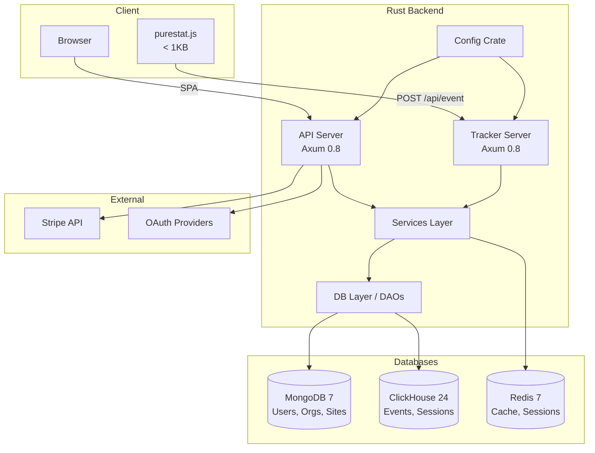

<p align="center">
  
</p>

<h3 align="center">Pure, clean, honest stats</h3>

<p align="center">
  <a href="LICENSE"></a>
  <a href="https://www.rust-lang.org/"></a>
  <a href="https://vuejs.org/"></a>
</p>

---

<p align="center">
  <a href="purestat-intro.mp4">
    
  </a>
</p>

> **Intro Video**: See the full product walkthrough in [`purestat-intro.mp4`](purestat-intro.mp4) — registration, org setup, site tracking, dashboard, goals, team invites, and billing in under 2 minutes.

---

**Purestat** is a privacy-first, cookie-free web analytics platform that gives you accurate website insights without compromising your visitors' privacy. Built with Rust for performance and reliability, it serves as a self-hostable alternative to Plausible and Fathom.

## Features

| Feature | Description |
|---------|-------------|
| Privacy-first | Cookie-free tracking via daily-rotating SHA-256 visitor hashes |
| Lightweight tracker | < 1KB gzipped JS snippet, SPA-aware |
| Real-time dashboard | Live visitor count and activity stream |
| Goals & conversions | Track custom events with properties and revenue |
| Multi-tenant | Organizations with owner/admin/viewer roles |
| Stripe billing | Free, Pro, and Business plans with usage limits |
| OAuth login | Google, GitHub, Facebook, LinkedIn, Microsoft |
| Dark mode | Full dark/light theme support |
| i18n ready | Internationalization via vue-i18n |
| CSV export | Export filtered analytics data |
| API keys | Scoped programmatic access to stats |
| Invite system | Shareable invite links for team onboarding |

## Tech Stack

| Layer | Technology |
|-------|------------|
| Backend | Rust 1.85, Axum 0.8, JWT, argon2 |
| Frontend | Vue 3.5, Vuetify 3, Pinia 3, Chart.js |
| Analytics DB | ClickHouse 24 (time-series events & sessions) |
| Config DB | MongoDB 7 (users, orgs, sites, goals) |
| Cache | Redis 7 |
| Tracker | TypeScript, Rollup, < 1KB gzipped output |
| Infra | Docker Compose, Caddy 2 (auto-HTTPS) |

## Architecture



## Quick Start

### Prerequisites

- Docker and Docker Compose
- Rust 1.85+ (with cargo)
- Bun (for frontend and tracker builds)

### 1. Clone the repository

```bash
git clone https://github.com/purestat/purestat.git
cd purestat
```

### 2. Start infrastructure services

```bash
docker-compose up -d
```

This starts MongoDB, ClickHouse, and Redis.

### 3. Run the backend

```bash
cargo run
```

### 4. Run the frontend

```bash
cd ui
bun install
bun dev
```

The application will be available at `http://localhost:5173` (frontend) with the API at `http://localhost:3000`.

### Full Docker deployment

```bash
docker-compose -f docker-compose.full.yml up -d
```

See [docs/deployment.md](docs/deployment.md) for production setup with Caddy and auto-HTTPS.

## Documentation

| Document | Description |
|----------|-------------|
| [Architecture](docs/architecture.md) | Crate graph, request flow, scaling strategy |
| [Data Model](docs/data-model.md) | MongoDB collections, ClickHouse tables, indexes |
| [API Reference](docs/api.md) | Full endpoint reference with examples |
| [JS Tracker](docs/tracker.md) | Installation, custom events, technical details |
| [Frontend / UI](docs/ui.md) | Vue app structure, stores, components, theming |
| [Testing](docs/testing.md) | Integration tests, E2E tests, coverage |
| [Deployment](docs/deployment.md) | Docker, production, environment variables |
| [Use Cases](docs/use-cases.md) | User flow walkthroughs |

## Contributing

1. Fork the repository
2. Create a feature branch (`git checkout -b feat/my-feature`)
3. Write tests for your changes
4. Ensure all tests pass (`cargo test -p purestat-tests`)
5. Run `cargo fmt` and `cargo clippy`
6. Commit using conventional commits (`feat:`, `fix:`, `refactor:`, etc.)
7. Open a pull request

## License

This project is licensed under the [MIT License](LICENSE).
