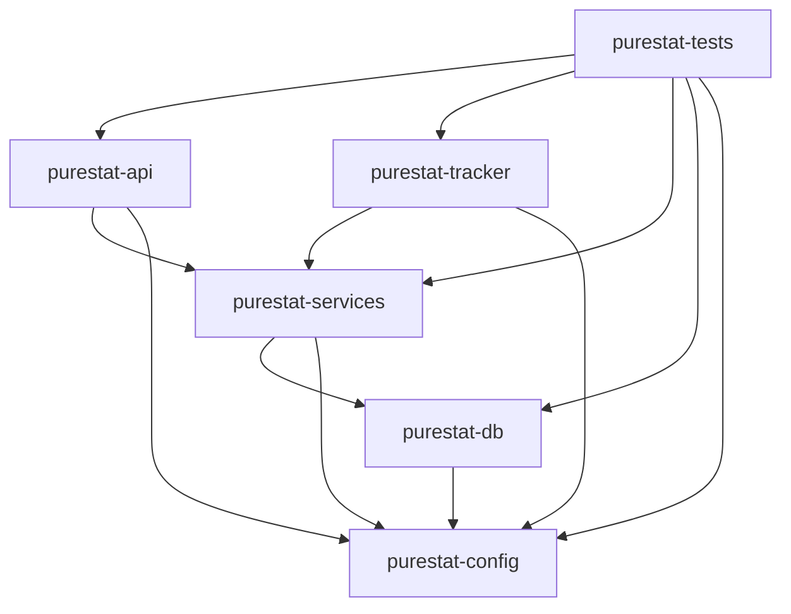
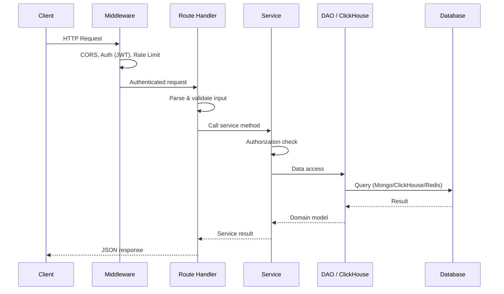
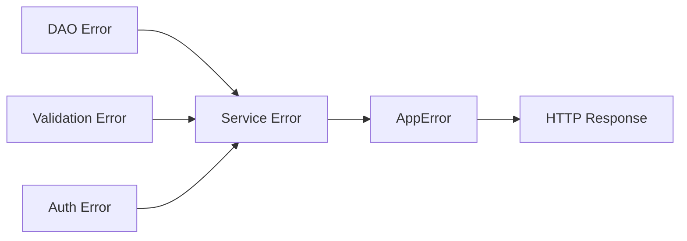
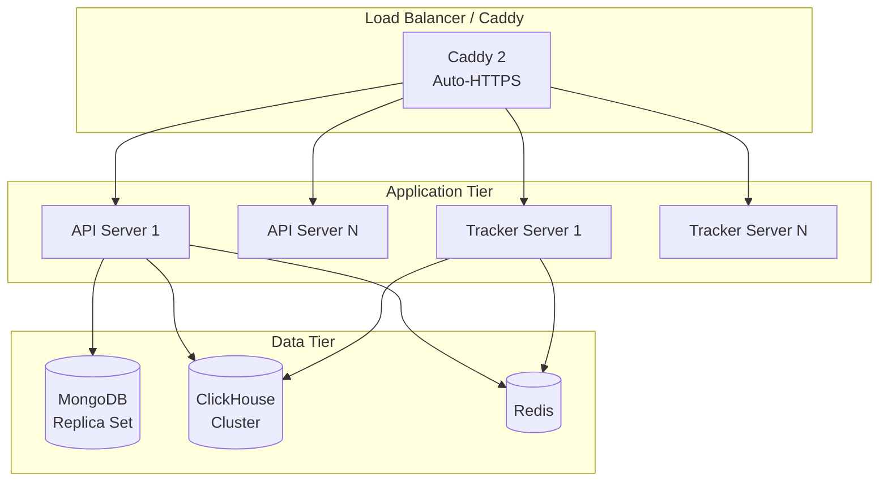

# Architecture

## Overview

Purestat is organized as a Rust workspace with six crates arranged in a layered dependency graph. Each crate has a single responsibility, and dependencies flow strictly downward.

```
api  /  tracker  /  tests
         |
      services
         |
         db
         |
       config
```

- **config** -- Loads and validates configuration from files and environment variables (`PURESTAT__SECTION__KEY` format).
- **db** -- Database access layer (DAOs) for MongoDB, ClickHouse, and Redis. Defines all collection schemas, queries, and migrations.
- **services** -- Business logic layer. Orchestrates DAOs, enforces authorization, and implements domain rules.
- **api** -- HTTP server (Axum 0.8) exposing the authenticated REST API for the frontend SPA.
- **tracker** -- Lightweight HTTP server (Axum 0.8) dedicated to event ingestion from the JS tracker.
- **tests** -- Integration test crate that depends on all other crates and exercises full request flows.

## Crate Dependency Graph



## Request Flow

Every HTTP request follows the same layered path through the system.



### Middleware Stack

Requests pass through the following Axum middleware layers (in order):

1. **CORS** -- Configurable allowed origins for the SPA and tracker.
2. **Request logging** -- Structured tracing with request ID propagation.
3. **Authentication** -- Extracts JWT from the `token` httpOnly cookie or `Authorization: Bearer` header. Populates the request extensions with the authenticated user.
4. **Rate limiting** -- Per-IP rate limits via Redis, with separate limits for the tracker endpoint.

### Route Handlers

Route handlers are thin. They:

1. Deserialize and validate the request (path params, query params, JSON body).
2. Extract the authenticated user from request extensions.
3. Delegate to the appropriate service method.
4. Map the service result to an HTTP response.

## AppState

The `AppState` struct is the shared application state injected into every handler via Axum's `State` extractor.

```rust
pub struct AppState {
    pub config: Arc<AppConfig>,
    pub mongo: Arc<MongoClient>,
    pub clickhouse: Arc<ClickHouseClient>,
    pub redis: Arc<RedisClient>,
    pub stripe: Arc<StripeClient>,
    // Service instances
    pub auth_service: Arc<AuthService>,
    pub org_service: Arc<OrgService>,
    pub site_service: Arc<SiteService>,
    pub event_service: Arc<EventService>,
    pub stats_service: Arc<StatsService>,
    pub billing_service: Arc<BillingService>,
    // ...
}
```

All fields are wrapped in `Arc` for cheap cloning across async tasks. The state is constructed once at startup and passed to the Axum router.

## Error Handling

Errors propagate through a unified `AppError` type that implements Axum's `IntoResponse`.



Each error variant maps to an HTTP status code and a consistent JSON envelope:

```json
{
  "error": {
    "code": "NOT_FOUND",
    "message": "Site not found"
  }
}
```

Error wrapping preserves context at each layer:

```rust
// DAO layer
MongoError(#[from] mongodb::error::Error),

// Service layer
self.site_dao.find_by_id(id).await
    .map_err(|e| ServiceError::Database(format!("failed to find site {id}: {e}")))?

// Handler layer -> automatic via IntoResponse
```

## Scaling Strategy

### Separate Tracker Server

The tracker ingestion endpoint (`POST /api/event`) runs as a separate binary (`purestat-tracker`) that can be scaled independently. Event ingestion is write-heavy with minimal validation, so it benefits from dedicated resources and a separate scaling policy.

### ClickHouse Sharding

ClickHouse tables are partitioned by month and ordered by `(site_id, date, visitor_hash, session_id, timestamp)`. For horizontal scaling:

- Use ClickHouse's `Distributed` table engine to shard across multiple nodes.
- Shard key: `site_id` to keep all events for a site on the same shard.
- Replicate with `ReplicatedMergeTree` for high availability.

### Redis Caching

Redis serves two purposes:

1. **Rate limiting** -- Sliding window counters per IP.
2. **Cache** -- Frequently-queried stats (realtime visitor counts, cached dashboard aggregations) with short TTLs.

### MongoDB Scaling

MongoDB stores configuration data (users, orgs, sites) with relatively low write volume. A replica set provides high availability. Sharding is unlikely to be needed given the data profile.

### Deployment Topology


