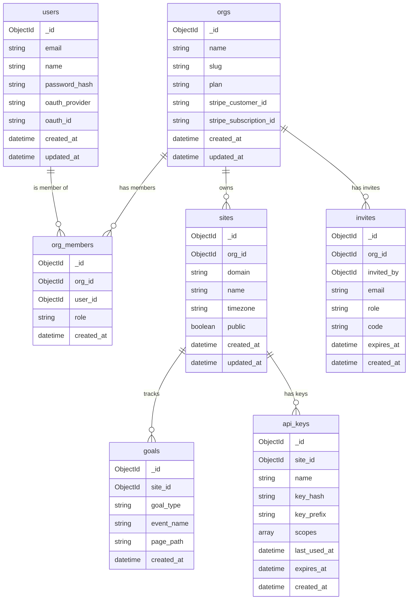

# Data Model

## Overview

Purestat uses two databases for different purposes:

- **MongoDB 7** -- Stores configuration and account data (users, organizations, sites, goals, invites, API keys).
- **ClickHouse 24** -- Stores time-series analytics data (events, sessions) optimized for fast aggregation queries.

## MongoDB Collections

### Entity Relationship Diagram



### users

Stores registered user accounts. Passwords are hashed with argon2. OAuth users have `oauth_provider` and `oauth_id` set instead of `password_hash`.

| Field | Type | Description |
|-------|------|-------------|
| `_id` | ObjectId | Primary key |
| `email` | String | Unique email address |
| `name` | String | Display name |
| `password_hash` | String | argon2 password hash (null for OAuth users) |
| `oauth_provider` | String | OAuth provider name: `google`, `github`, `facebook`, `linkedin`, `microsoft` (null for email users) |
| `oauth_id` | String | Unique ID from the OAuth provider (null for email users) |
| `created_at` | DateTime | Account creation timestamp |
| `updated_at` | DateTime | Last profile update timestamp |

**Indexes:**

| Keys | Unique | Purpose |
|------|--------|---------|
| `{ email: 1 }` | Yes | Login lookup, duplicate prevention |
| `{ oauth_provider: 1, oauth_id: 1 }` | Yes (sparse) | OAuth login lookup |

### orgs

Organizations are the primary tenant boundary. Each org has a billing plan and optional Stripe subscription.

| Field | Type | Description |
|-------|------|-------------|
| `_id` | ObjectId | Primary key |
| `name` | String | Organization display name |
| `slug` | String | URL-safe unique slug |
| `plan` | String | Current plan: `free`, `pro`, `business` |
| `stripe_customer_id` | String | Stripe customer ID (null if free) |
| `stripe_subscription_id` | String | Stripe subscription ID (null if free) |
| `created_at` | DateTime | Creation timestamp |
| `updated_at` | DateTime | Last update timestamp |

**Indexes:**

| Keys | Unique | Purpose |
|------|--------|---------|
| `{ slug: 1 }` | Yes | URL routing, duplicate prevention |
| `{ stripe_customer_id: 1 }` | Yes (sparse) | Stripe webhook lookup |

### org_members

Join collection linking users to organizations with a specific role.

| Field | Type | Description |
|-------|------|-------------|
| `_id` | ObjectId | Primary key |
| `org_id` | ObjectId | Reference to `orgs._id` |
| `user_id` | ObjectId | Reference to `users._id` |
| `role` | String | Member role: `owner`, `admin`, `viewer` |
| `created_at` | DateTime | Membership creation timestamp |

**Indexes:**

| Keys | Unique | Purpose |
|------|--------|---------|
| `{ org_id: 1, user_id: 1 }` | Yes | Prevent duplicate memberships |
| `{ user_id: 1 }` | No | List orgs for a user |

### sites

Websites being tracked within an organization.

| Field | Type | Description |
|-------|------|-------------|
| `_id` | ObjectId | Primary key |
| `org_id` | ObjectId | Reference to `orgs._id` |
| `domain` | String | Website domain (e.g. `example.com`) |
| `name` | String | Human-readable site name |
| `timezone` | String | IANA timezone for date bucketing (e.g. `America/New_York`) |
| `public` | Boolean | Whether the dashboard is publicly accessible |
| `created_at` | DateTime | Creation timestamp |
| `updated_at` | DateTime | Last update timestamp |

**Indexes:**

| Keys | Unique | Purpose |
|------|--------|---------|
| `{ org_id: 1, domain: 1 }` | Yes | Prevent duplicate domains per org |
| `{ domain: 1 }` | No | Tracker event lookup by domain |

### goals

Conversion goals tracked for a site. Goals can be event-based (custom event name match) or page-based (page path match).

| Field | Type | Description |
|-------|------|-------------|
| `_id` | ObjectId | Primary key |
| `site_id` | ObjectId | Reference to `sites._id` |
| `goal_type` | String | Goal type: `event` or `page` |
| `event_name` | String | Custom event name to match (for event goals) |
| `page_path` | String | Page path pattern to match (for page goals) |
| `created_at` | DateTime | Creation timestamp |

**Indexes:**

| Keys | Unique | Purpose |
|------|--------|---------|
| `{ site_id: 1 }` | No | List goals for a site |
| `{ site_id: 1, goal_type: 1, event_name: 1 }` | Yes (sparse) | Prevent duplicate event goals |
| `{ site_id: 1, goal_type: 1, page_path: 1 }` | Yes (sparse) | Prevent duplicate page goals |

### invites

Pending invitations to join an organization. Invites have an expiration and a unique shareable code.

| Field | Type | Description |
|-------|------|-------------|
| `_id` | ObjectId | Primary key |
| `org_id` | ObjectId | Reference to `orgs._id` |
| `invited_by` | ObjectId | Reference to `users._id` (the inviter) |
| `email` | String | Invitee email address |
| `role` | String | Role to assign on acceptance: `admin`, `viewer` |
| `code` | String | Unique invite code for the shareable link |
| `expires_at` | DateTime | Expiration timestamp |
| `created_at` | DateTime | Creation timestamp |

**Indexes:**

| Keys | Unique | Purpose |
|------|--------|---------|
| `{ code: 1 }` | Yes | Invite link lookup |
| `{ org_id: 1 }` | No | List invites for an org |
| `{ expires_at: 1 }` | No (TTL) | Auto-delete expired invites |

### api_keys

Scoped API keys for programmatic access to site stats. The full key is shown once at creation; only the hash and a prefix are stored.

| Field | Type | Description |
|-------|------|-------------|
| `_id` | ObjectId | Primary key |
| `site_id` | ObjectId | Reference to `sites._id` |
| `name` | String | Human-readable key name |
| `key_hash` | String | SHA-256 hash of the full API key |
| `key_prefix` | String | First 8 characters of the key (for display) |
| `scopes` | Array\<String\> | Permitted scopes: `stats:read`, `realtime:read`, `export:read` |
| `last_used_at` | DateTime | Timestamp of last use (null if never used) |
| `expires_at` | DateTime | Optional expiration timestamp |
| `created_at` | DateTime | Creation timestamp |

**Indexes:**

| Keys | Unique | Purpose |
|------|--------|---------|
| `{ key_hash: 1 }` | Yes | API key authentication lookup |
| `{ site_id: 1 }` | No | List keys for a site |

## ClickHouse Tables

### events

Stores individual pageview and custom events. Partitioned by month for efficient time-range queries and automatic data management.

```sql
CREATE TABLE events (
    site_id       String,
    timestamp     DateTime64(3),
    date          Date,
    visitor_hash  String,
    session_id    String,
    event_name    String    DEFAULT 'pageview',

    -- Page data
    pathname      String,
    hostname      String,
    referrer      String,

    -- UTM parameters
    utm_source    String    DEFAULT '',
    utm_medium    String    DEFAULT '',
    utm_campaign  String    DEFAULT '',
    utm_term      String    DEFAULT '',
    utm_content   String    DEFAULT '',

    -- Device data
    browser       String,
    browser_version String,
    os            String,
    os_version    String,
    device_type   String,

    -- Location (derived from IP at ingest time, IP not stored)
    country       String    DEFAULT '',
    region        String    DEFAULT '',
    city          String    DEFAULT '',

    -- Custom properties (JSON string)
    props         String    DEFAULT '{}',

    -- Revenue tracking
    revenue_amount   Decimal64(4)  DEFAULT 0,
    revenue_currency String        DEFAULT ''
)
ENGINE = MergeTree()
PARTITION BY toYYYYMM(date)
ORDER BY (site_id, date, visitor_hash, session_id, timestamp)
TTL date + INTERVAL 2 YEAR
SETTINGS index_granularity = 8192;
```

### sessions

Aggregated session data derived from events. A session groups consecutive events from the same visitor with no more than 30 minutes of inactivity.

```sql
CREATE TABLE sessions (
    site_id         String,
    date            Date,
    visitor_hash    String,
    session_id      String,
    start_timestamp DateTime64(3),
    end_timestamp   DateTime64(3),

    -- Entry page
    entry_pathname  String,
    entry_hostname  String,

    -- Exit page
    exit_pathname   String,

    -- Referrer (first touch)
    referrer        String,

    -- UTM (first touch)
    utm_source      String  DEFAULT '',
    utm_medium      String  DEFAULT '',
    utm_campaign    String  DEFAULT '',

    -- Device (from first event)
    browser         String,
    os              String,
    device_type     String,

    -- Location
    country         String  DEFAULT '',
    region          String  DEFAULT '',
    city            String  DEFAULT '',

    -- Aggregates
    pageviews       UInt32  DEFAULT 1,
    events_count    UInt32  DEFAULT 1,
    duration        UInt32  DEFAULT 0,
    is_bounce       UInt8   DEFAULT 1
)
ENGINE = MergeTree()
PARTITION BY toYYYYMM(date)
ORDER BY (site_id, date, visitor_hash, session_id)
TTL date + INTERVAL 2 YEAR
SETTINGS index_granularity = 8192;
```

## Data Retention

Both ClickHouse tables have a **2-year TTL** applied at the partition level. ClickHouse automatically drops partitions older than 2 years during its background merge process.

For MongoDB, the `invites` collection uses a TTL index on `expires_at` to automatically remove expired invitations.

All other MongoDB data is retained indefinitely (user accounts, organizations, sites, etc.).

## Privacy: Visitor Hash

Purestat does not use cookies, localStorage, or any client-side persistent identifiers. Instead, visitors are identified using a **daily-rotating hash**:

```
visitor_hash = SHA-256(daily_salt + domain + ip_address + user_agent)
```

Key properties:

- **Daily salt rotation** -- The salt changes every day at midnight UTC, making it impossible to track a visitor across days.
- **Domain-scoped** -- The same visitor on different domains produces different hashes.
- **One-way** -- SHA-256 is irreversible; the original IP and user agent cannot be recovered from the hash.
- **IP not stored** -- The raw IP address is used only during hash computation and is never written to the database.
- **No cross-site tracking** -- Because the domain is part of the hash input, visitors cannot be correlated across different websites.

This approach complies with GDPR and other privacy regulations by design, as no personally identifiable information is stored.
