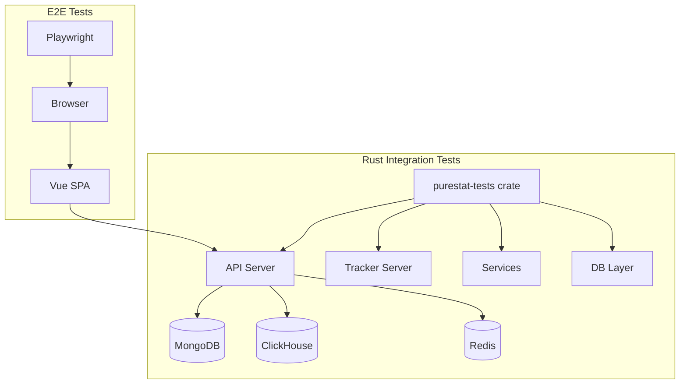

# Testing

Purestat uses a two-tier testing strategy: Rust integration tests for backend API verification and Playwright end-to-end tests for full-stack user flow validation.

## Test Architecture



### Integration Tests (Rust)

The `purestat-tests` crate is a dedicated test crate that depends on all other crates in the workspace. It spins up the full application stack (API server, databases) and exercises complete request flows.

Tests cover:
- Authentication (register, login, logout, OAuth flows)
- Organization CRUD and membership management
- Site CRUD and configuration
- Event ingestion and visitor hashing
- Stats queries and aggregation
- Goal creation and conversion tracking
- Invite creation, link generation, and acceptance
- API key lifecycle and scoped access
- Stripe billing webhooks and plan enforcement
- Rate limiting
- Authorization (role-based access control)

### End-to-End Tests (Playwright)

Playwright tests run against the full stack (backend + frontend) in a browser and verify user-facing flows. Located in the `e2e/` directory.

## Running Integration Tests

### Prerequisites

The integration tests require running instances of MongoDB, ClickHouse, and Redis. You can start them with Docker Compose:

```bash
docker-compose up -d
```

### Run all integration tests

```bash
cargo test -p purestat-tests
```

### Run with race detection

```bash
cargo test -p purestat-tests -- --test-threads=1
```

Since Rust does not have Go-style race detection, limiting to a single thread helps surface concurrency issues when tests share database state.

### Run a specific test

```bash
cargo test -p purestat-tests test_name
```

### Run with logging output

```bash
RUST_LOG=debug cargo test -p purestat-tests -- --nocapture
```

## Running E2E Tests

### Prerequisites

- The full application stack must be running (backend + frontend).
- Playwright browsers must be installed.

### Install dependencies

```bash
cd e2e
bun install
bunx playwright install
```

### Run all E2E tests

```bash
cd e2e
bun run test
```

### Run in headed mode (visible browser)

```bash
cd e2e
bun run test -- --headed
```

### Run a specific test file

```bash
cd e2e
bun run test -- tests/auth.spec.ts
```

### View test report

```bash
cd e2e
bunx playwright show-report
```

## Dual-Target Testing

Tests can run against two targets:

1. **Native** -- Services run directly on the host machine. Faster iteration during development.
2. **Docker** -- Services run inside Docker containers. Matches the production environment.

### Native target

Start infrastructure, then run the backend and tests locally:

```bash
# Terminal 1: Infrastructure
docker-compose up -d

# Terminal 2: Backend
cargo run

# Terminal 3: Frontend
cd ui && bun dev

# Terminal 4: Tests
cargo test -p purestat-tests
```

### Docker target

Run everything in Docker:

```bash
docker-compose -f docker-compose.full.yml up -d
cargo test -p purestat-tests
```

## Test Script

The `scripts/test.sh` script automates test execution for both targets:

```bash
# Run tests against native services
./scripts/test.sh native

# Run tests against Docker services
./scripts/test.sh docker
```

The script handles:
- Starting required infrastructure if not running
- Waiting for services to be healthy
- Running integration tests
- Running E2E tests
- Reporting results
- Optionally tearing down infrastructure

### Usage

```
./scripts/test.sh <target> [options]

Targets:
  native    Run against locally running services
  docker    Run against Docker containers

Options:
  --integration-only    Skip E2E tests
  --e2e-only            Skip integration tests
  --no-teardown         Leave infrastructure running after tests
  --verbose             Enable debug logging
```

## Coverage

### Rust Coverage with cargo-tarpaulin

Generate code coverage reports for the Rust codebase:

```bash
# Install tarpaulin
cargo install cargo-tarpaulin

# Run with coverage
cargo tarpaulin -p purestat-tests --out html

# Open report
open tarpaulin-report.html
```

For CI, output in lcov format:

```bash
cargo tarpaulin -p purestat-tests --out lcov --output-dir coverage/
```

### Coverage Targets

| Crate | Target |
|-------|--------|
| purestat-config | 80%+ |
| purestat-db | 70%+ |
| purestat-services | 80%+ |
| purestat-api | 75%+ |
| purestat-tracker | 75%+ |

## CI/CD Notes

### GitHub Actions

The CI pipeline runs on every push and pull request:

1. **Lint** -- `cargo fmt --check` and `cargo clippy -- -D warnings`
2. **Build** -- `cargo build --release`
3. **Integration tests** -- `cargo test -p purestat-tests` (with Docker Compose services)
4. **Frontend lint** -- `cd ui && bun run lint`
5. **Frontend build** -- `cd ui && bun run build`
6. **E2E tests** -- Playwright tests against the full Docker stack
7. **Coverage** -- `cargo tarpaulin` with results uploaded to coverage tracker

### Test Database Isolation

Each integration test run uses a unique database name prefix (based on a random seed) to avoid conflicts when running tests in parallel in CI. Test databases are cleaned up after the test suite completes.

### Flaky Test Handling

- E2E tests retry failed tests up to 2 times before marking them as failed.
- Integration tests that depend on timing (e.g., TTL, rate limiting) use configurable timeouts that are extended in CI.
